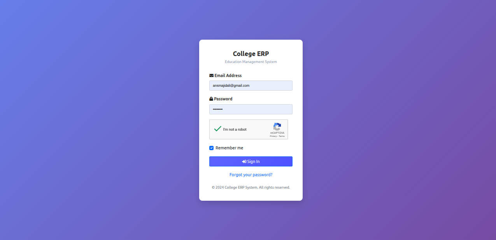

<div align="center">

# 🎓 College ERP System

A comprehensive, role-based Enterprise Resource Planning system for educational institutions — built with Python and Django.

</div>

---

## 📋 Table of Contents

- [About](#-about)
- [Features](#-features)
- [Demo Credentials](#-demo-credentials)
- [Technology Stack](#-technology-stack)
- [Installation](#-installation)
- [Environment Variables](#-environment-variables)
- [Project Structure](#-project-structure)
- [Understanding the Codebase](#-understanding-the-codebase)
- [Screenshots](#-screenshots)
- [Roadmap](#-roadmap)
- [Contributing](#-contributing)
- [Support](#-support)

---

## 🎯 About

**College ERP** is a full-stack Enterprise Resource Planning system designed for educational institutions. It streamlines administrative tasks, student management, and staff operations in one unified platform, with dedicated dashboards for **Admin (HOD)**, **Staff**, and **Student** roles.

### ✨ Why Choose This ERP?

- 🚀 **Modern Tech Stack** — Built with Django for robust performance
- 📊 **Data-Driven Insights** — Visual dashboards for performance tracking
- 👥 **Multi-Role Support** — Separate interfaces for Admin, Staff, and Students
- 🔒 **Secure** — Role-based access control and custom email authentication
- 📱 **Responsive Design** — Works seamlessly on desktop and mobile

---

## 🚀 Features

### 👨‍💼 Admin (HOD) Dashboard

<details>
<summary>Click to expand Admin features</summary>

- 📈 **Analytics Dashboard** — Overview charts for student/staff performance, courses, and subjects
- 👥 **Staff Management** — Complete CRUD operations for staff members
- 🎓 **Student Management** — Add, update, and delete student records
- 📚 **Course Management** — Organize and manage academic courses
- 📖 **Subject Management** — Handle subject assignments and details
- 📅 **Session Management** — Control academic sessions and terms
- ✅ **Attendance Monitoring** — View and track student attendance
- 💬 **Feedback System** — Review and respond to feedback from students/staff
- 🏖️ **Leave Management** — Approve or reject leave applications

</details>

### 👨‍🏫 Staff / Teacher Portal

<details>
<summary>Click to expand Staff features</summary>

- 📊 **Performance Dashboard** — Track student progress and subject analytics
- ✏️ **Attendance Management** — Mark and update student attendance
- 📝 **Result Entry** — Add and modify student examination results
- 🏖️ **Leave Applications** — Apply for personal leave
- 💭 **Feedback Channel** — Send feedback to administration

</details>

### 🎓 Student Portal

<details>
<summary>Click to expand Student features</summary>

- 📊 **Personal Dashboard** — View attendance, results, and leave status
- 📅 **Attendance Tracking** — Monitor class attendance records
- 🎯 **Result Portal** — Access examination results and grades
- 🏖️ **Leave Requests** — Submit leave applications
- 💬 **Feedback System** — Provide feedback to HOD

</details>

---

## 🔑 Demo Credentials

For quick evaluation on a live/demo deployment:

| Role | Email | Password |
|------|-------|----------|
| 👨‍🎓 **Admin** | `rahul@gmail.com` | `rahul` |
| 👨‍🎓 **Student** | `s1@gmail.com` | `s1` |
| 👨‍🏫 **Staff** | `t1@gmail.com` | `t1` |

> For local development, create your own **Admin (HOD)** account using `python manage.py createsuperuser` (see [Installation](#-installation) below).

---

## 🛠️ Technology Stack

| Category | Technologies |
|----------|-------------|
| **Backend** | Python, Django |
| **Frontend** | HTML5, CSS3, JavaScript, Bootstrap |
| **Database** | SQLite (development), PostgreSQL-ready (production, via `dj-database-url`) |
| **Authentication** | Django Auth with a custom email-based backend, Google reCAPTCHA |
| **Static Files** | WhiteNoise (compressed manifest storage) |
| **Deployment** | PythonAnywhere |

---

## 📥 Installation

### Prerequisites

- ✅ [Git](https://git-scm.com/)
- ✅ [Python 3.11 or 3.12](https://www.python.org/downloads/) *(Python 3.13 removes the built-in `cgi` module, which older Django versions still rely on — use 3.11/3.12, or `pip install legacy-cgi` if you must use 3.13)*
- ✅ [pip](https://pip.pypa.io/en/stable/installing/)

### Step-by-Step Setup

#### 1️⃣ Clone the Repository

```bash
git clone https://github.com/Ansarimajid/College-ERP.git
cd College-ERP
```

#### 2️⃣ Create a Virtual Environment


**Option A: Python venv**

<details>
<summary>Windows</summary>

```bash
python -m venv venv
venv\Scripts\activate
pip install -r requirements.txt
```
</details>

<details>
<summary>macOS / Linux</summary>

```bash
python3 -m venv venv
source venv/bin/activate
pip install -r requirements.txt
```
</details>

> 💡 **Tip:** Always activate your environment before working on the project — you should see `(Django-env)` or `(venv)` in your terminal prompt.

#### 3️⃣ Configure Environment Variables

Create a `.env` file in the project root — see [Environment Variables](#-environment-variables) below for the full list.

#### 4️⃣ Apply Database Migrations

```bash
python manage.py migrate
```

#### 5️⃣ Create a Superuser (Admin / HOD Account)

```bash
python manage.py createsuperuser
```

Follow the prompts to set your email and password.

#### 6️⃣ Collect Static Files

Required for CSS/JS to load correctly (the project uses WhiteNoise with manifest-based static storage):

```bash
python manage.py collectstatic
```

#### 7️⃣ Run the Development Server

```bash
# Windows
python manage.py runserver

# macOS/Linux
python3 manage.py runserver
```

🎉 **Success!** Visit **http://127.0.0.1:8000** in your browser — you should see the College ERP login page.

> ⚠️ **Security Note:** Never use `ALLOWED_HOSTS = ['*']` in production. Keep it scoped to `['localhost', '127.0.0.1']` for local dev, and your actual domain in production.

---

## 🔑 Environment Variables

The project reads the following from environment variables (create a `.env` file in the project root, or set them in your shell/hosting provider):

```env
SECRET_KEY=your-django-secret-key
DEBUG=True
DATABASE_URL=sqlite:///db.sqlite3
EMAIL_HOST_USER=your-email@gmail.com
EMAIL_HOST_PASSWORD=your-gmail-app-password
```

| Variable | Description |
|---|---|
| `SECRET_KEY` | Django's cryptographic signing key — keep this private in production |
| `DEBUG` | `True` for local development, `False` in production |
| `DATABASE_URL` | Parsed by `dj-database-url`; defaults to local SQLite if unset |
| `EMAIL_HOST_USER` | Gmail address used to send password-reset and notification emails |
| `EMAIL_HOST_PASSWORD` | Gmail **App Password** (not your regular password — requires 2FA enabled on the Google account) |

> ⚠️ **Note:** `EMAIL_HOST_USER` and `EMAIL_HOST_PASSWORD` must be set as actual environment variable **names** that `os.environ.get()` reads — not hardcoded email addresses or passwords directly in `settings.py`. Never commit real credentials to the repository.

---

## 🗂 Project Structure

```
College-ERP/
│
├── college_management_system/      # Django project configuration
│   ├── settings.py                 # App settings, database, static files
│   ├── urls.py                     # Root URL dispatcher
│   └── wsgi.py                     # WSGI entry point for deployment
│
├── main_app/                       # Core Django application
│   ├── migrations/                 # Database migration files
│   ├── templates/
│   │   └── main_app/               # All HTML templates
│   │       ├── admin_templates/    # HOD/Admin views
│   │       ├── staff_templates/    # Staff views
│   │       └── student_templates/  # Student views
│   ├── static/                     # App-level static files
│   ├── models.py                   # All database models
│   ├── views.py                    # All role-based view logic
│   ├── forms.py                    # Django forms
│   ├── urls.py                     # App-level URL routes
│   └── EmailBackend.py             # Custom email authentication
│
├── media/                          # User-uploaded files (profile photos)
├── Showcase/                       # Screenshots used in README
├── reports_and_resource/           # Supporting documents
│
├── manage.py                       # Django management script
├── requirements.txt                # Python dependencies
├── college-erp.yml                 # Conda environment definition
├── Procfile                        # Deployment config (PythonAnywhere)
├── db.sqlite3                      # SQLite database (development only)
├── .gitignore
├── LICENSE
├── README.md
├── CODE_OF_CONDUCT.md
└── CONTRIBUTING.md                 # Contribution guidelines
```

---

## 🧠 Understanding the Codebase

### Three User Roles

| Role | Description | Key Capabilities |
|------|-------------|-----------------|
| **HODAdmin** | Head of Department / Administrator | Full CRUD on staff, students, courses, subjects, sessions; view all attendance & results; manage leave approvals & feedback |
| **Staff** | Teaching faculty | Mark attendance, enter results, apply for leave, send feedback to admin |
| **Student** | Enrolled students | View own attendance & results, apply for leave, send feedback |

### Key Models (`main_app/models.py`)

| Model | Purpose |
|-------|---------|
| `CustomUser` | Extended Django user with `user_type` (1=Admin, 2=Staff, 3=Student) |
| `AdminHOD` | Admin profile linked to `CustomUser` |
| `Staffs` | Staff profile with department/address info |
| `Students` | Student profile linked to course, session, profile pic |
| `Courses` | Academic course (e.g. B.Sc Computer Science) |
| `Subjects` | Subject under a course, assigned to a staff member |
| `SessionYearModel` | Academic year/session tracking |
| `Attendance` | Attendance session record per subject per date |
| `AttendanceReport` | Individual student attendance status per session |
| `LeaveReportStaff` / `LeaveReportStudent` | Leave request records |
| `FeedbackStaffs` / `FeedbackStudent` | Feedback messages to admin |
| `StudentResult` | Exam marks per student per subject |

### Authentication Flow

The project uses a custom authentication backend (`EmailBackend.py`) that allows login via **email** instead of username. Login redirects are handled based on `user_type` — any auth changes should preserve this routing logic.

---

## 📸 Screenshots




---

## 🗺️ Roadmap

### ✅ Completed Features

- [x] Multi-role authentication system
- [x] Complete CRUD operations for all entities
- [x] Attendance management system
- [x] Result management with CBVs
- [x] Leave application workflow
- [x] Feedback system
- [x] Email notifications
- [x] Google reCAPTCHA integration
- [x] Profile management for all roles
- [x] Dynamic dashboard analytics
- [x] Responsive design
- [x] Password reset functionality

### 🔜 Upcoming Features

| Priority | Feature |
|----------|---------|
| 🔴 High | SMS notifications on leave approval/rejection |
| 🔴 High | Advanced analytics dashboard with PDF/Excel export |
| 🟡 Medium | Online examination module |
| 🟡 Medium | Fee management & payment tracking |
| 🟡 Medium | Timetable generator |
| 🟡 Medium | Parent portal (read-only attendance & results view) |
| 🟢 Low | Library management integration |
| 🟢 Low | Django REST Framework API layer |
| 🟢 Low | Dark mode UI option |
| 🟢 Low | i18n / Hindi & Urdu language support |

---


Quick start:
```bash
git checkout -b feature/your-feature-name
# make your changes
git commit -m "feat: describe your change"
git push origin feature/your-feature-name
```
Then open a Pull Request.

---

## 💖 Support the Project

If you find this project helpful, please consider:

- ⭐ **Star this repository** on GitHub
- 🐛 **Report bugs** to help improve the project
- 💡 **Suggest new features** via issues
- 📢 **Share** with fellow developers
- 👨‍💻 **Contribute** to the codebase

---

<div align="center">


*If this project helped you, consider giving it a star! ⭐*

</div>
